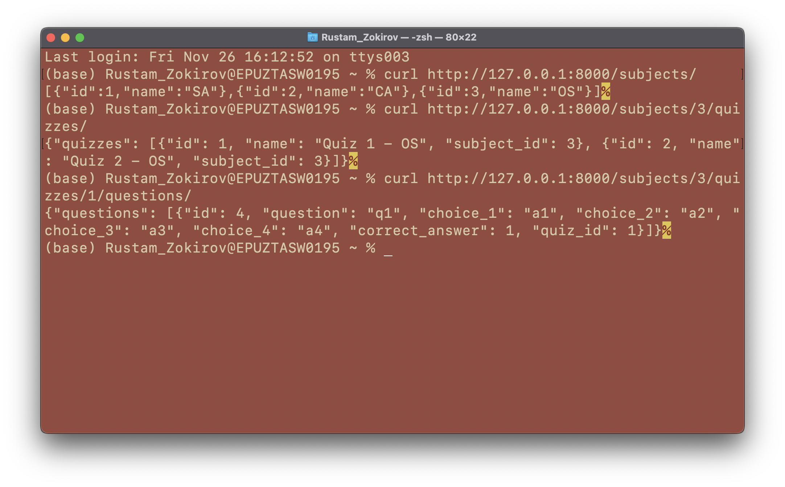

# OS Project - Quiz System API Documentation

## How to run the project?
```
python manage.py migrate
python manage.py createsuperuser
python manage.py runserver
```

- Admin site URL http://127.0.0.1:8000/

## API Endpoints
- Get all subjects `curl http://127.0.0.1:8000/subjects/`
  - Response will look like `[{"id":1,"name":"SA"},{"id":2,"name":"CA"},{"id":3,"name":"OS"}]`
- Get all quizzes of the particular subject `curl http://127.0.0.1:8000/subjects/<int:subject_id>/quizzes/`
    - Response `{"quizzes": [{"id": 3, "name": "Quiz 1 - CA", "subject_id": 2}]}`
- Get all question of the particular quiz `curl http://127.0.0.1:8000/subjects/<int:subject_id>/quizzes/<int:quiz_id>/questions`
    - Response `{"questions": [{"id": 1, "question": "Q1", "choice_1": "A1", "choice_2": "A2", "choice_3": "A3", "choice_4": "A4", "correct_answer": 1, "quiz_id": 3}]}`
- Get all quizzes for all subjects `curl http://127.0.0.1:8000/quizzes/`
- Get all questions for all quizzes `curl http://127.0.0.1:8000/questions/`


